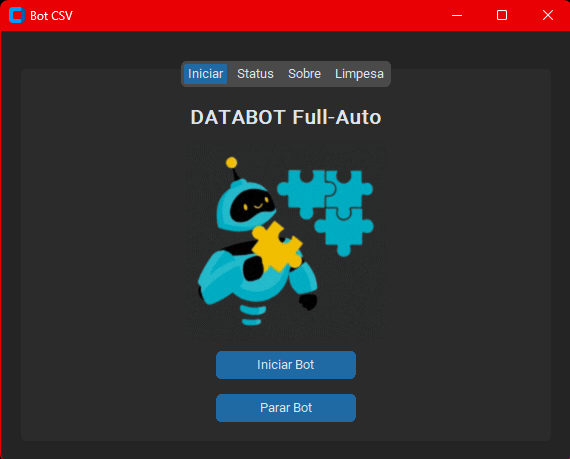
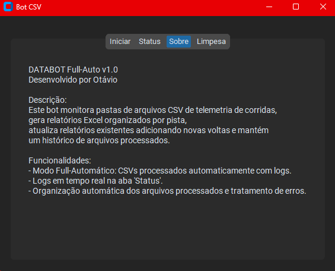
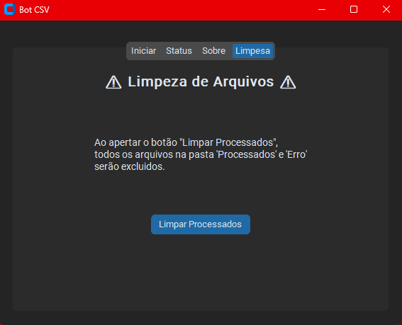
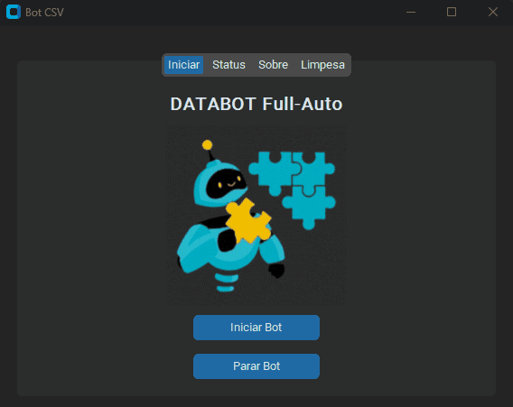

# 🤖📒 BotPython

[](https://github.com/Otavio72/Assetto-Corsa-Stints-ACS-/blob/main/LICENSE)

**ACS** surgiu durante minha participação em um campeonato da **World Sim Series (WSS)**. Nos treinos, percebi a necessidade de uma análise mais detalhada dos stints (sequências de voltas), o que inspirou a criação deste projeto.

---

## 🛠️ Sobre o projeto

O **ACS** é uma aplicação local que extrai dados de telemetria do jogo Assetto Corsa, envia os tempos de volta para um servidor com banco de dados **MySQL**, e os recupera para gerar gráficos comparativos entre dois stints. Esses dados são enviados à API do **GEMINI**, onde um "engenheiro virtual" interpreta os resultados e fornece feedback técnico via chat.


### Funcionalidades principais:

- 🧾 Extração de dados via **Shared Memory**, com base no mod template de [Hunter Vaners](https://github.com/huntervaners/Template_Assetto_Corsa_App)
- 📈 Geração de gráficos comparativos com **Matplotlib**
- 🤖 Feedback técnico com **GEMINI API**
- 💾 Armazenamento em banco de dados **MySQL**
- 🌙 Interface gráfica com **CustomTkinter**
- 🔌 Comunicação entre cliente e servidor via Sockets com select para conexões simultâneas

---

## 💻 Layout da aplicação

### Página inicial


### Página de Status


### Menu de Stints

---

## 🗂️ GIFs
### Bot Rodando


## 🚀 Tecnologias utilizadas

### 🔙 Back end
- Python

### 🎨 Interface
- CustomTkinter
---

### 📦 Instalação

```bash
# clonar repositório
git clone https://github.com/Otavio72/Assetto-Corsa-Stints-ACS-.git

Ative o ambiente virtual:
  python -m venv .venv

No Windows (PowerShell):
  ```powershell
  .venv\Scripts\Activate.ps1

No Linux/macOS:
  source .venv/bin/activate

# acesse o diretorio
cd Assetto-Corsa-Stints-ACS-

Instale as dependências:
  pip install -r requirements.txt

# acesse o dirtetorio da versao demo
cd DEMO

# Rode
  python ACS.vDEMO.py

```

# Autor
Otávio Ribeiro
[🔗LinkedIn](https://www.linkedin.com/in/otávio-ribeiro-57a359197)
